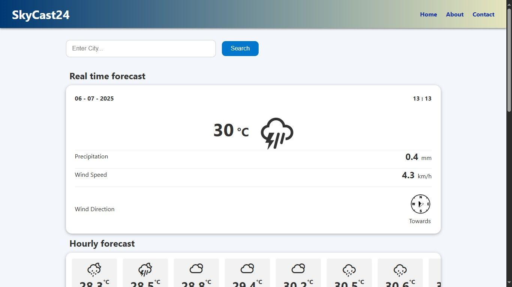

# SkyCast24

**SkyCast24** is a sleek, responsive weather web application that delivers accurate, real-time weather information based on your current location or a city of your choice. It offers 24-hour hourly forecasts, 7-day predictions, and dynamic weather visuals—all built with pure HTML, CSS, and Vanilla JavaScript.

---

## Features

- **Auto-detect current location** using the Geolocation API
- **Search weather by city name**
- **Live time display** with automatic updates every minute
- **7-day detailed forecast** with humidity, wind speed, and precipitation
- **24-hour hourly forecast** in a clean, scrollable format
- **Day & Night dynamic weather icons**
- **Wind direction indicator** with real-time visual rotation
- Responsive design optimized for both desktop and mobile devices

---

## Project Structure

```
SkyCast24/
├── assets/
│   ├── css/
│   │   ├── description-credits.css
│   │   ├── privacy.css
│   │   └── style.css
│   ├── images/
│   │   ├── backgrounds/
|   |   |   └── about-section.png
│   │   ├── icons/
|   |   |   ├──direction-layout.png
|   |   |   └──direction-pointer.png
│   │   ├── screenshots/
|   |   |   ├──Screenshot-about-contact.png
|   |   |   ├──Screenshot-hourly&daily-data.png
|   |   |   └──Screenshot-real-time-data.png
│   │   └── favicon.ico
│   ├── js/
│   │   └── script.js
│   └── data/
│       ├── weather-icon-day.json
│       └── weather-icon-night.json
├── index.html
├── privacy.html
├── description-credits.html
└── README.md
```

---

## Technologies Used

- ✅ **HTML5**, **CSS3**
- ✅ **Vanilla JavaScript (ES6+)**
- ✅ **Open-Meteo API** – for weather forecast data
- ✅ **OpenStreetMap Nominatim API** – for city name to lat/lon geocoding
- ✅ **Weather Icons by Erik Flowers** – for dynamic weather visuals
- ✅ **Geolocation API** – to fetch user’s current location

---

## Weather Icons Mapping

SkyCast24 uses two JSON files:
- `weather-icon-day.json`
- `weather-icon-night.json`

These map Open-Meteo weather codes (0–99) to the corresponding Erik Flowers icon classes based on the time of day (day/night).

---

## 📸 Screenshots




---

## How to Run Locally

1. Clone or download the repository.
2. Open `index.html` in your web browser.
3. Allow location access for instant local weather.
4. Or, search any city name or coordinates to get specific results.

---

## Privacy

SkyCast24 does **not collect** any personal data, cookies, or analytics. All API calls are handled client-side in real time for maximum privacy.  
See: [privacy.html](privacy.html)

---

## License & Credits

- **Weather Icons by Erik Flowers** – [MIT / SIL OFL License](https://erikflowers.github.io/weather-icons/)
- **Weather data via Open-Meteo** – [open-meteo.com](https://open-meteo.com)
- **Geocoding via OpenStreetMap Nominatim** – [osm.org](https://nominatim.openstreetmap.org)

---

### Created with care by **RAJIV KUMAR GOND**